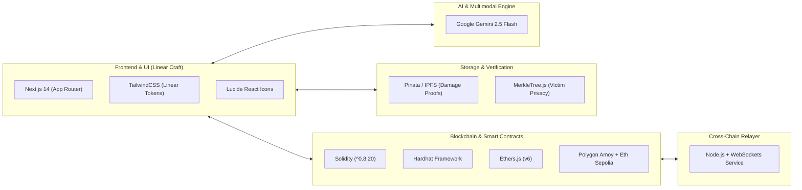

# 🛠️ Pulse: Complete Tech Stack & Application Architecture

> **A comprehensive breakdown of the technology stack, smart contract infrastructure, and page-by-page feature map for the Pulse Emergency Aid Protocol.**

---

## 🏗️ 1. Complete Technology Stack



| Layer | Tools / Libraries | Purpose in Pulse |
| :--- | :--- | :--- |
| **Frontend Framework** | **Next.js 14** + **React 18** | Ultra-fast rendering, App Router, high-performance modular UI. |
| **Styling & Design** | **TailwindCSS** + `DESIGN.md` | Dark Linear-style aesthetic (`#010102`), 1px hairlines, zero visual clutter. |
| **Icons & Micro-UI** | **Lucide-React** + `canvas-confetti` | Clean iconography and instant payout celebrations. |
| **Smart Contracts** | **Solidity `^0.8.20`** + **Hardhat** | Secure escrow, category allocation, AI emergency triggers. |
| **Public Testnets** | **Polygon Amoy** + **Ethereum Sepolia** | Multi-chain test environments (Zero real money required). |
| **Web3 Client** | **Ethers.js (v6)** + **MetaMask** | Wallet connection, contract calls, and transaction signing. |
| **Decentralized Storage** | **IPFS (Pinata API)** | Storing disaster damage photos, relief delivery receipts. |
| **AI & Multimodal Vision** | **Google Gemini 2.5 Flash** | Multimodal damage photo validation, Crisis Severity Oracle, and multilingual victim copilot. |
| **Privacy Engine** | **MerkleTreeJS** + **Keccak256** | Zero-knowledge victim identity verification on-chain. |
| **Cross-Chain Relayer** | **Node.js + Ethers.js** | Syncs donation state between Sepolia and Amoy in real time. |

---

## 📱 2. Page-by-Page Application Breakdown

```
Pulse Web Application
├── / (Global Crisis Command Center)
├── /crisis/[id] (Crisis Details & 1-Click Multi-Chain Donate)
├── /beneficiary (Beneficiary Verification & Gasless Claim Portal)
├── /audit (Glass-Box Live Visual Audit Ledger)
└── /oracle (AI Disaster Severity Oracle Simulator)
```

---

### 🏠 Page 1: Global Crisis Command Center (`/`)
*The main mission-control dashboard providing high-level situational awareness.*

#### Key Features:
* **Live Mission Ticker:**
  * 🔴 **Active Global Crises:** (e.g. 4 Active Disasters)
  * 💰 **Total Multi-Chain Funds Raised:** ($1,240,500 across Sepolia & Amoy)
  * 🤝 **Verified Victims Helped:** (14,280 Families)
  * ⏱️ **Avg. Disbursement Time:** (< 2.4 seconds)
* **Crisis Cards Grid:** Active incident cards (e.g. *Turkey 7.8M Earthquake*, *Kerala Flood Relief*, *Horn of Africa Drought*) with live funding progress bars and category badges.
* **Top Navigation Bar:**
  * 🦊 **MetaMask Connect Wallet** (Displays connected chain & balance).
  * ⚡ **"Judge Demo / Simulation Mode" Toggle** (Instant 1-click fallback switch guaranteeing a crash-proof pitch).

---

### 💳 Page 2: Crisis Details & 1-Click Multi-Chain Donate (`/crisis/[id]`)
*The dedicated emergency control terminal for an active disaster incident.*

#### Key Features:
* **Fund Allocation Visualizer:**
  * 🩺 Medical Care (40%) | 🍞 Food Rations (30%) | ⛺ Emergency Shelter (30%)
* **1-Click Cross-Chain Donation Terminal:**
  * Toggle between **Ethereum Sepolia (ETH)** and **Polygon Amoy (POL)**.
  * Enter donation amount with instant USD conversion.
  * Select custom relief category tag (Medical, Food, Shelter, General).
  * Click **"Donate with Instant Verification"** $\to$ executes transaction and generates an on-chain receipt with direct block explorer links.
* **Live On-Chain Feed:** Real-time stream of incoming multi-chain transactions.

---

### 🛡️ Page 3: Beneficiary Verification & Claim Portal (`/beneficiary`)
*Where on-ground relief NGOs register victims and victims claim direct aid.*

#### Key Features:
* **For Victims / Beneficiaries:**
  * **Zero-Knowledge Merkle Claim Box:** Enter claim code or connect wallet $\to$ instant cryptographic verification against on-chain Merkle Root $\to$ **1-Click Gasless Claim**.
  * **Zero Gas Fee Notice:** Transparent badge: *"Gas fee sponsored by Pulse Protocol"*.
* **For Field Relief NGOs (Admin Console):**
  * Batch upload verified victim list (CSV/Excel).
  * 1-Click Merkle Tree Generator that calculates the 32-byte Merkle Root.
  * Attach IPFS damage assessment reports and commit root to the blockchain.
* **Offline Emergency Voucher Generator:** Generates printable QR emergency vouchers for victims without smartphones.

---

### 🔍 Page 4: "Glass-Box" Live Public Audit Ledger (`/audit`)
*The ultimate transparency engine that traces every single dollar from donor to victim.*

#### Key Features:
* **Interactive Fund Flow Pipeline (Sankey Flow):**
  * An animated visual stream showing:  
    $$\text{Donors (Sepolia + Amoy)} \longrightarrow \text{Pulse Vault} \longrightarrow \text{Relief Allocation} \longrightarrow \text{Verified Beneficiaries}$$
* **Searchable Live Audit Table:**
  * Filter by: *Transaction Hash, Beneficiary Address, Aid Category, Proof IPFS Hash, Timestamp*.
  * Click any row to preview the pinned IPFS relief delivery photo receipt.
* **1-Click Cryptographic Proof Export:** Download on-chain audit proof as a certified JSON/PDF file.

---

### 🤖 Page 5: AI Disaster Severity Oracle Simulator (`/oracle`)
*Demonstrates automated, zero-delay emergency fund unlocking powered by Gemini 2.5 Flash.*

#### Key Features:
* **Live Crisis Severity Gauge:** Interactive Richter scale (Earthquake) and flood water level meter.
* **Simulated Emergency Trigger:**
  * Move the slider to **Magnitude 7.4 (Red Alert)**.
  * Click **"Broadcast Critical Alert"** $\to$ Gemini 2.5 Flash Oracle calls smart contract `triggerEmergencyUnlock()`.
  * Instantly watch 20% of contingency reserves unlock on-screen for immediate field rescue!

---

## 🗺️ 3. Routes & Navigation Summary

| Route | Page Name | Primary User |
| :--- | :--- | :--- |
| **`/`** | **Command Center** | General Donors & Hackathon Judges |
| **`/crisis/[id]`** | **Donation & Incident Terminal** | Multi-Chain Donors |
| **`/beneficiary`** | **Verification & Claim Portal** | Disaster Victims & Field NGOs |
| **`/audit`** | **Glass-Box Audit Ledger** | Donors, Regulators & Auditors |
| **`/oracle`** | **AI Severity Control** | Emergency First Responders & Judges |
